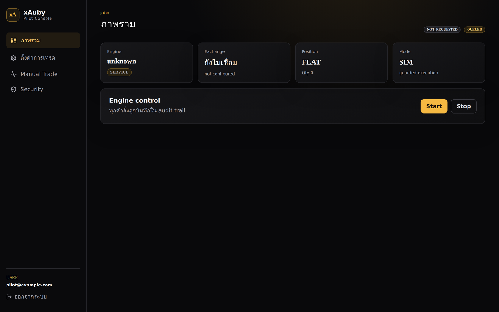
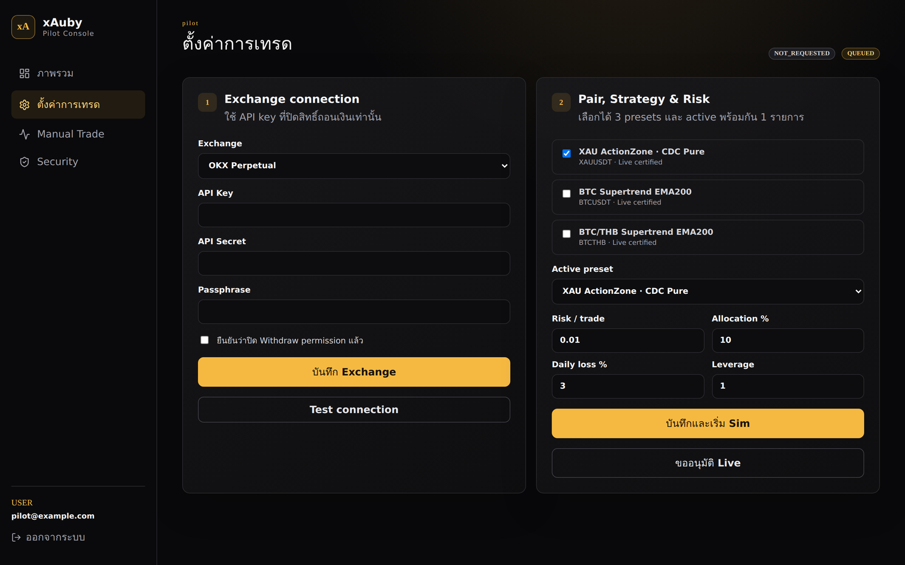

<div align="center">

# xAuby

**Alternative Store of Value Trading System**

Automated trading for the **OKX XAUUSDT perpetual swap**, operated from a
browser: a multi-tenant **web SaaS console** (xAuby Pilot) in front of a
plugin-driven Python engine with simulation-first execution, guarded risk,
full observability, and Telegram/TUI fallbacks.

[](https://www.python.org/)
[](https://www.okx.com/)
[-f5a623)](saas-web/README.md)
[](docs/README.md)
[](https://x-auby.vercel.app/)

[Live Website](https://x-auby.vercel.app/) | [Web Console](#xauby-pilot--the-web-console) | [Quick Start](#quick-start) | [Runtime Baseline](#current-runtime-baseline) | [Configuration](#configuration) | [Backtest](#backtest-optimization-and-rd) | [Deploy](#deployment)

</div>

---



> The xAuby Pilot Console: engine status, exchange connection, position, and
> execution mode at a glance, with every control action recorded in the audit
> trail.

## Overview

xAuby is an event-driven trading system for store-of-value markets. The
committed baseline trades **XAUUSDT** on **OKX USDT-settled perpetual swap**
via CCXT — long and short at 1x leverage — using the CDC ActionZone strategy
(`xauby_actionzone`).

The engine loop:

1. Ingest candles and tickers over REST plus WebSocket.
2. Resolve the configured strategy, timeframe, execution mode, and portfolio budget per active pair.
3. Run each pair through its own strategy plugin instance and runner.
4. Optionally route a pair through `RegimeRouter` when its gates are enabled.
5. Place exchange orders — or simulated ones — with ATR stop-loss, trailing, breakeven, and partial take-profit logic.
6. Persist trades and telemetry to SQLite plus JSONL for replay, incidents, and dashboards.
7. Operate through the web console, Textual TUI, CLI/launcher, and Telegram.

> **Start in simulation.** Live trading requires several explicit gates
> (see [Trading modes](#trading-modes)) and should only be enabled after risk
> limits, alerts, and replay validation have been reviewed.

---

## xAuby Pilot — the Web Console

The primary operating surface is a web SaaS stack:

- **Control plane** — `xauby/saas`: a FastAPI app (`python -m xauby.saas`,
  default port `8790`) that manages users, tenants, encrypted exchange
  credentials, engine supervision, and an audit trail.
- **Pilot SPA** — [`saas-web/`](saas-web/README.md): a Vite + React console
  that talks to the control plane and deploys independently (e.g. Vercel).



What the console gives an operator:

| Area | Behavior |
|------|----------|
| Onboarding | Email/password or Google sign-in; new accounts wait for Owner approval (pilot capacity is capped, 3 accounts by default) |
| Exchange connection | OKX Perpetual API key + secret + passphrase, stored encrypted; requires an explicit "withdraw permission disabled" attestation and a connection test |
| Strategy presets | Curated pair/strategy presets (e.g. **XAU ActionZone · CDC Pure**, live-certified); up to 3 selected, 1 active |
| Risk controls | Per-tenant risk/trade, allocation %, daily loss %, and leverage, bounded to conservative pilot limits |
| Engine control | Start/stop the tenant engine in guarded SIM mode; Live activation is a separate approval flow |
| Manual trade | Order ticket with preview + **Trade PIN** confirmation; manual orders bypass signals but never risk gates, SL, or execution locks |
| Security | TOTP two-factor (required before Live and Owner admin), recovery codes, trade PIN management |
| Owner admin | User approval queue and live-request review |

Run it locally for development:

```bash
# Backend (dev-login mode, no secrets needed)
XAUBY_SAAS_DEV_LOGIN=1 python -m xauby.saas          # http://127.0.0.1:8790

# Frontend
cd saas-web && npm install && npm run dev            # http://localhost:5173
```

For production, `xauby.saas.admin` provides `migrate`, `bootstrap-owner`, and
`password-reset-link` commands; `saas-web/vercel.json` rewrites `/api/*` and
`/auth/*` to your backend origin (edit it for your deployment — see
[saas-web/README.md](saas-web/README.md)). Security posture and audit notes
live in [docs/security-saas-audit.md](docs/security-saas-audit.md).

---

## Current Runtime Baseline

Exchange: **OKX USDT-settled swap** (`exchange.provider: ccxt`, `ccxt_id: okx`,
`market_type: swap`, `margin_mode: isolated`, `position_mode: one_way`), fee
assumption `0.05%` taker. CCXT maps `XAUUSDT` to the OKX gold perpetual
`XAU/USDT:USDT`.

| Symbol | Mode | Strategy | Primary TF | Confirm TF | Sides |
|--------|------|----------|------------|------------|-------|
| `XAUUSDT` | `live` | `xauby_actionzone` (CDC ActionZone) | `4h` | `1d` | `long` + `short` (stop-and-reverse) |

The pair runs **CDC-pure**: `disable_stop_loss: true`, so exits are zone-flip
driven rather than exchange-stop driven, and sizing uses a fixed fraction of
equity (`position_pct: 0.95`) instead of an SL-distance formula. Layered exits:

- **Partial take-profit** — one-shot, banks 50% of the position at **+12%**
  (`partial_tp_pct: 12.0`, `partial_tp_fraction: 0.5`); dashboards show it as
  `PTP` / `Partial TP` with `pending` or `banked` state.
- **Minimal ROI decay** — take-profit floor decays with holding time: `8%`
  immediately, `5%` after 24h, `3%` after 72h.
- **CDC flip** — a zone flip closes (and reverses) the position.

Entries place a **LIMIT** at the ticker and, with `entry_market_fallback`,
top up any unfilled remainder with a MARKET order after the timeout. Exits use
MARKET on urgent triggers and LIMIT otherwise.

Risk defaults (`bot_config.yaml`):

| Setting | Value |
|---------|-------|
| Per-trade risk (`risk_pct`) | `2%` |
| Max allocation per trade | `25%` |
| Max daily loss | `6%` |
| Max open positions | `1` |
| Max leverage | `1x` |
| Drawdown guard kill-switch | `25%` below equity high-water mark |

Backtests proxy XAU to `PAXGUSDT` (deep history on Global Binance) via
`strategy_params.backtest_data_proxy`.

**Router safety gate:** a pair with `mode: live` and `regime_router_enabled:
true` is forced to **sim** unless it also has `regime_router_live_confirmed:
true`. The XAU baseline runs with the RegimeRouter off. NO_TRADE regimes block
new entries, keep stop protection, tighten trailing to 1x ATR, and can force
close after a configured number of candles.

---

## Quick Start

Requirements: Python 3.10+ (3.12 recommended), an OKX API key for live use,
optional Telegram bot.

```bash
git clone https://github.com/iisara555/xAuby.git
cd xAuby

python3 -m venv venv
source venv/bin/activate
pip install -r requirements.txt
pip install -e .

cp .env.example .env
python run_xauby.py --simulate   # first run: simulation
python health_check.py           # one-shot health probe
```

Before live trading, provide OKX credentials in `.env` (never commit it):

```bash
OKX_API_KEY=...
OKX_API_SECRET=...
OKX_API_PASSPHRASE=...
LIVE_TRADING=true
```

Entry points:

| Command | What it does |
|---------|--------------|
| `python run_xauby.py --simulate` / `--live` | Start the trading engine directly |
| `python launcher.py` | Interactive Textual launcher (engine, dashboard, config, backtest, tools) |
| `xauby` / `xauby --sim` / `xauby --live` | Installed console script (also `python -m xauby`) |
| `xauby restart [--live]` | Controlled restart; live path runs preflight checks |
| `xauby update` | Deploy `origin/main` (`scripts/deploy_from_github.sh`) then restart |
| `python -m xauby.saas` | Web SaaS control plane (port 8790) |
| `./scripts/start_webui.sh` | Read-only mobile WebUI |
| `python -m xauby.ui.textual_tui.app` | Textual TUI standalone |
| `python health_check.py` | Standalone health check |

Notes for a first live run:

- The bot reads the OKX **trading/swap account**, not every OKX wallet. A
  `0.00 USDT` portfolio usually means funds sit in an unrelated funding wallet
  or the API key lacks scope.
- **Never enable withdrawal permission** on the API key — read and trade only.
- Run exactly one engine instance per runtime root; `<root>/.engine.lock`
  guards against doubles.

---

## Configuration

| File | Role |
|------|------|
| `.env` | Secrets, `LIVE_TRADING`, `TELEGRAM_*` — gitignored, never committed |
| `bot_config.yaml` | Engine, Strategy, Portfolio, notifications, backtest/optimizer — committed, key-free |
| `coin_whitelist.json` | Active pairs: strategy, timeframes, mode, sides, router gates — committed |

Config is split into three responsibilities, and putting a value in the wrong
layer is a recurring bug source because live, backtest, replay, and the
optimizer all resolve through the **same** strategy/portfolio resolver:

| Layer | Owns | Must not own |
|-------|------|--------------|
| **Engine** (`bot_config.yaml` top level) | Exchange, logging, monitoring, notifications, global guards, feature flags | Strategy signal/exit params |
| **Strategy** (`strategy.config.<id>`, whitelist `strategy_params`) | Signal/exit logic, SL/trailing/breakeven, strategy timeframe | Credentials or sizing |
| **Portfolio** (`portfolio.position_sizing`, per-symbol overrides) | Position sizing, allocation, capital | Indicator/signal rules |

**Rule:** anything that can change a backtest result lives under Strategy or
Portfolio config. The engine stays strategy-agnostic.

`bot_config.yaml -> exchange:` is the single source of truth for exchange
selection and economics — engine, backtest, replay, health probe, and ops
scripts all resolve through `xauby/runtime/exchange_config.py`:

```yaml
exchange:
  provider: ccxt
  ccxt_id: okx
  quote_asset: USDT
  settle_asset: USDT
  fee_pct: 0.0005
  market_type: swap
  margin_mode: isolated
  position_mode: one_way
  api_key_env: OKX_API_KEY
  api_secret_env: OKX_API_SECRET
```

OKX auth needs `OKX_API_KEY`, `OKX_API_SECRET`, and one of
`OKX_API_PASSPHRASE` / `OKX_PASSWORD` / `OKX_API_PASSWORD`. See
[docs/configuration.md](docs/configuration.md) for the full reference and
[docs/multi-exchange-ccxt.md](docs/multi-exchange-ccxt.md) for adapter notes.

### Trading modes

| Mode | How to enable | Behavior |
|------|---------------|----------|
| Simulation | `--simulate`, `simulate_only: true`, or per-asset `mode: sim` | No real orders; SimBroker ledger when enabled |
| Live | `--live` **and** `LIVE_TRADING=true` **and** `simulate_only: false` **and** per-asset `mode: live` | Real orders on the configured exchange |
| Read-only | `--read-only` or `read_only: true` | Signals only, no orders |
| Semi-auto | `trading.mode: semi_auto` | Telegram confirmation before entry |
| Telegram pause | `/pause` + confirm | Blocks new entries at runtime; `/resume` clears |

---

## Other Interfaces

- **Textual TUI** — read-only dashboard (`LiteDB(readonly=True)`) with
  strategy-aware chart legends, trade log, incident explorer, and confirmed
  manual orders (`F7` BUY with bot-managed/manual-managed modes, `F8` SELL).
  See [docs/tui.md](docs/tui.md).
- **Mobile WebUI** — read-only browser dashboard (`./scripts/start_webui.sh`)
  showing runtime state, recent candles, ActionZone summary, EMA overlays, and
  partial-TP status; reach it over an SSH tunnel or Tailscale. See
  [docs/webui.md](docs/webui.md).
- **Telegram** — alerts plus operator commands (`/status`, `/pnl`, `/regime`,
  `/last`, `/health`, `/pause`, `/resume`) with inline confirmation buttons.
  See [docs/telegram.md](docs/telegram.md).
- **Promotional website** — standalone Next.js app in [`Website/`](Website/),
  deployed separately at [x-auby.vercel.app](https://x-auby.vercel.app/); it
  never touches trading credentials or runtime state.
- **Book** — long-form EN/TH documentation builds in [`docs/book/`](docs/book/).

---

## Strategies and Indicator Plugins

Strategies and their chart/legend indicators **travel together**: a new
strategy ships with a matching indicator plugin, tests, and a
`strategy_chart_indicators` mapping, or the dashboards drift from real
behavior.

- **Strategy plugin** — `xauby/strategies/<name>/strategy.py`: subclass
  `Strategy`, decorate with `@register("<name>")`, implement
  `analyze(ctx) -> Signal`. Strategies are pure analysts — they never place
  orders, touch the DB, or call the engine.
- **Indicator plugin** — `xauby/strategies/indicators/indicator_<name>.py`:
  `compute(df, config)` appends named columns; `display_config` drives the
  terminal chart and TUI legend.

Naming: canonical strategy ids use the `xauby_` prefix; legacy ids are
aliased in `xauby/strategies/registry.py` (`cdc_action_zone` →
`xauby_actionzone`, `donchian_trend` → `xauby_donchian_trend`,
`smc_luxalgo` → `xauby_smc_pro`), so old configs keep working.

Shorts: strategies emit `open_short` / `close_short`; execution is gated
per-pair by `allowed_sides` + `short_live_enabled` plus the swap adapter's
capabilities. On the current baseline the XAU pair runs long + short
stop-and-reverse in live.

Research plugins (tagged `research`, e.g. `donchian_short`,
`supertrend_short`, `rsi2_short`, `rsi2_meanrev`, `vol_breakout`) are
**hard-blocked from live pairs** by the engine — sim/backtest only.

An optional static (AST) sandbox scan
(`architecture.strategy_sandbox_strict: true`) rejects third-party strategy
plugins that touch the engine, DB, network, or use `eval`/`exec`.

---

## Backtest, Optimization, and R&D

Backtest and live resolve strategy and portfolio config through the same
resolver, keeping replay results aligned with live behavior. Backtests pull
multi-year history from **Global Binance** by default (`backtest.data_base_url`)
while live trading uses OKX; the XAU slot backtests against its `PAXGUSDT`
proxy.

```bash
# Replay a backtest with the live config
python scripts/replay_backtest.py --symbol XAUUSDT --config bot_config.yaml

# Low-CPU parameter optimizer
python scripts/optimize_pair_configs.py

# Strategy selection (dry-run by default; --apply writes the best passing candidate)
python scripts/select_pair_strategy.py --symbol XAUUSDT --candidates xauby_actionzone,supertrend_ema200,bbkc_squeeze

# Fetch multi-year klines for research
python scripts/fetch_global_klines.py --symbol BTCUSDT --timeframe 1h --years 3

# Regime-aware strategy evaluation harness (gatekeeper for strategy changes)
python scripts/regime_strategy_eval.py --timeframe 1h --grid
```

A candidate strategy may replace an incumbent in `regime_router.mapping` only
if it beats the incumbent's Profit Factor on both train and test splits with
enough trades and bounded drawdown — protocol and verdicts in
[docs/regime_strategy_selection.md](docs/regime_strategy_selection.md).

**Replay validation** — run after restarts, incidents, and config changes to
check that recorded live `signal_evaluated` events match a strategy replay of
the same run:

```bash
python scripts/replay_validate.py <run_id> --symbol XAUUSDT
```

### Testing

Plain `unittest`, no extra runner:

```bash
PYTHONPATH=. python3 -m unittest discover -s tests -q
```

---

## Deployment

Recommended live startup on a VPS after simulation and health checks:

```bash
mkdir -p core/logs
env -u DEFAULT_SYMBOL XAUBY_DEFAULT_SYMBOL=XAUUSDT XAUBY_FOCUS_SYMBOL=XAUUSDT \
  SIMULATE_ONLY=false BOT_READ_ONLY=false \
  ./venv/bin/python run_xauby.py --live --pair XAUUSDT
```

Supervise the engine with tmux or systemd, never an unmanaged SSH shell.
Day-to-day operations:

```bash
xauby update   # deploy origin/main + controlled restart (with preflight)
xauby restart  # controlled restart without pulling code
```

The controlled restart path accepts positions already tracked by the bot and
blocks unknown balances or untracked open orders.

**Multi-instance:** every runtime artifact (DB, lock, logs, sim balances,
state JSON) is namespaced under a runtime root. Run isolated engines side by
side by giving each its own root:

```bash
XAUBY_HOME=/data/acctA python run_xauby.py --live    # -> /data/acctA/...
XAUBY_INSTANCE_ID=acctB python run_xauby.py --live   # -> core/acctB/...
```

See [docs/multi-instance.md](docs/multi-instance.md).

---

## Project Layout

```text
xAuby/
|-- run_xauby.py           # engine launcher (sim/live/read-only)
|-- launcher.py            # thin shim for the xauby.launcher package
|-- bot_config.yaml        # engine + strategy + portfolio config (no secrets)
|-- coin_whitelist.json    # active pairs and per-pair gates
|-- health_check.py
|-- configs/               # OKX migration/paper configs
|-- docs/                  # operator/contributor docs + book/ + screenshots/
|-- scripts/               # ops + R&D scripts (backtest, optimize, deploy, replay)
|-- tests/                 # unittest modules
|-- saas-web/              # xAuby Pilot web console (Vite + React SPA)
|-- Website/               # promotional site (Next.js, deployed on Vercel)
`-- xauby/
    |-- engine/            # LiteTradingEngine mixins, brokers, risk, orders
    |-- strategies/        # strategy plugins + indicators/ + registries
    |-- runtime/           # pair registry, whitelist validation, config resolvers
    |-- regime/            # regime classifier + models
    |-- backtest/          # replay engine, optimizer, metrics, data fetch
    |-- observability/     # events, JSONL store, replay validation, incidents
    |-- saas/              # web SaaS control plane (FastAPI)
    |-- webui/             # read-only mobile WebUI
    |-- ui/                # terminal chart + Textual TUI
    |-- api/               # CCXT adapter (OKX) REST + WebSocket
    `-- notifications/     # Telegram bot, command poller, schedulers
```

---

## Safety Checklist

- [ ] Simulation run reviewed before live.
- [ ] OKX API key has trade permission for the intended account and **no withdraw permission**.
- [ ] OKX key, secret, and passphrase env vars present before a live restart.
- [ ] Funds are in the OKX account the bot reads for USDT swap trading.
- [ ] `risk_pct`, `max_position_per_trade_pct`, and global guards reviewed for account size.
- [ ] `risk.drawdown_guard` threshold set for your risk tolerance.
- [ ] `regime_router_live_confirmed: true` only after explicit per-pair sign-off.
- [ ] `architecture.strategy_sandbox_strict: true` when running third-party strategy plugins.
- [ ] `scripts/replay_validate.py <run_id> --symbol XAUUSDT` passes after restart.
- [ ] Telegram `/status` and `/health` verified; `/pause` + `/resume` tested in simulation.
- [ ] SaaS console: TOTP enabled, Trade PIN set, withdraw-off attestation honest.
- [ ] Engine supervised by tmux/systemd, one instance per runtime root.

---

## Disclaimer

This software is for education and research. Trading derivatives involves
substantial risk; past performance does not guarantee future results. Comply
with the configured exchange's API terms and applicable regulations.

---

<div align="center">

**xAuby** — disciplined OKX XAUUSDT automation, operated from the browser

</div>
