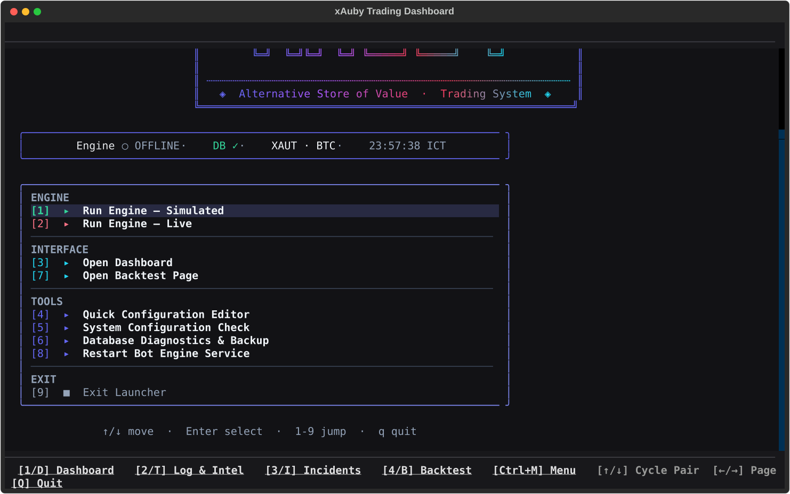
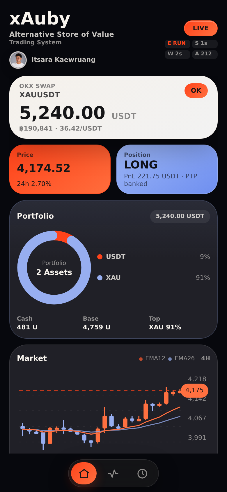
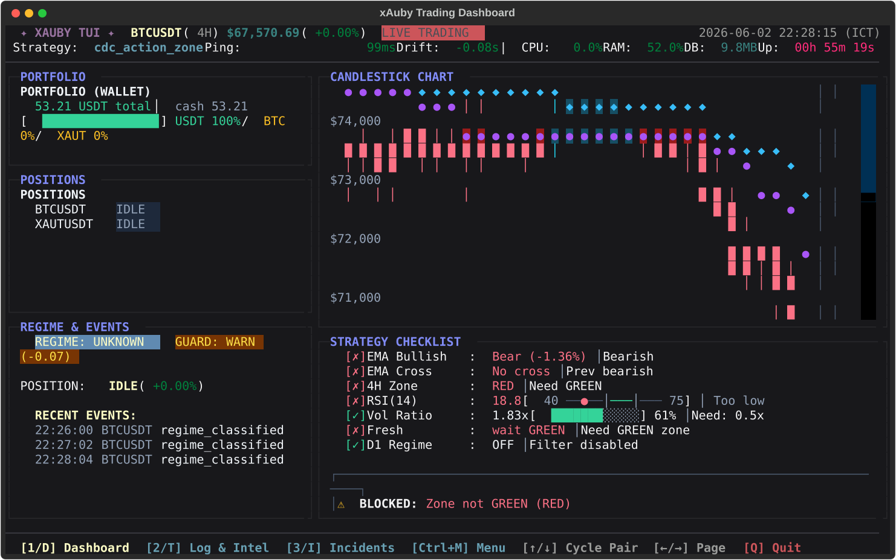
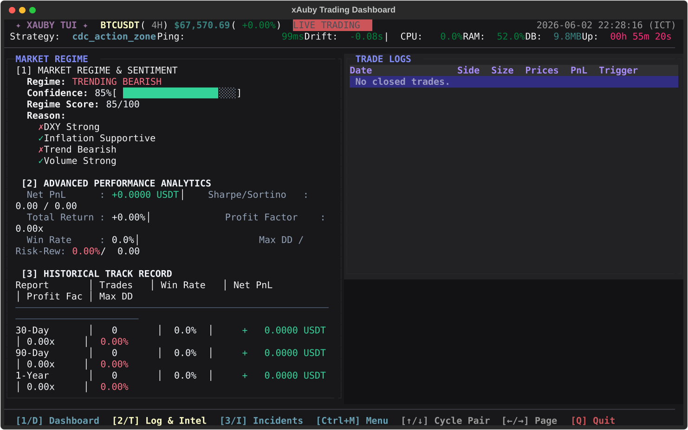
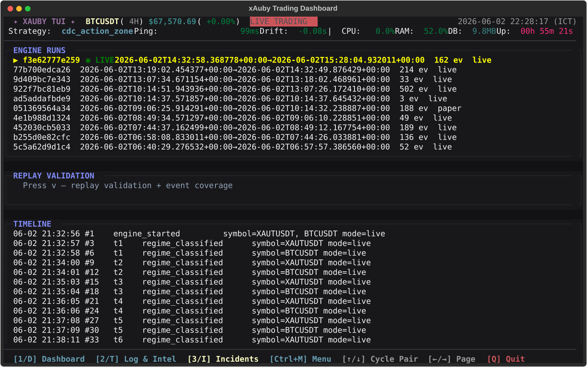
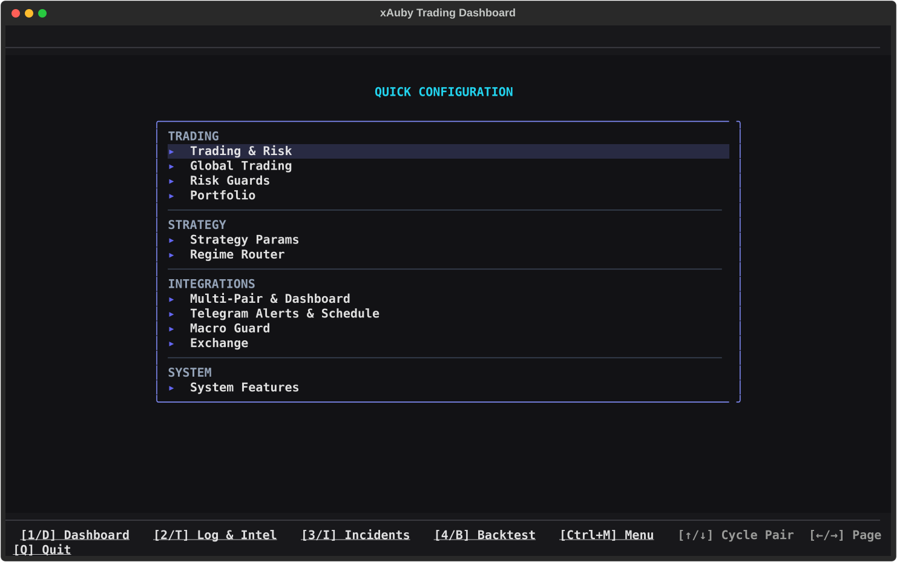

<div align="center">

# xAuby

**Alternative Store of Value Trading System**

Single-focus trading automation for **OKX XAUUSDT perpetual swap** with a pluggable
exchange gateway — native Binance.th or **CCXT** — featuring per-pair strategies,
isolated strategy runners, per-symbol execution mode, strategy-aware charts,
RegimeRouter support, exchange stop-losses, Textual TUI, and Telegram operations.

[](https://www.python.org/)
[](https://www.okx.com/)
[](https://textual.textualize.io/)
[](docs/README.md)

[Quick Start](#quick-start) | [Screens](#screens) | [Configuration](#configuration-essentials) | [Current Runtime State](#current-runtime-state) | [Backtest](#backtest-and-optimization) | [TUI](docs/tui.md) | [WebUI](docs/webui.md) | [Telegram](docs/telegram.md)

</div>

---



> The launcher opens a native Textual menu (a focusable `OptionList`): navigate
> with ↑/↓ + Enter or the mouse, or press the `1`-`9` shortcut. From here you
> start the engine (sim/live), open the dashboard, edit the quick config, run a
> backtest, restart the service, or open the diagnostics tools.

## Screens

### Mobile WebUI
<p align="center">
  
</p>

<details>
<summary>Dashboard · Trade log · Incident explorer (click to expand)</summary>

### Dashboard


### Trade log


### Incident explorer


### Quick Config (native Textual)


</details>

## Overview

**xAuby** is an event-driven trading system for store-of-value markets. The
current committed runtime is focused on **XAUUSDT** on **OKX USDT-settled swap**
via CCXT, with both long and short execution enabled at 1x leverage.

1. Ingest candles and tickers through REST plus WebSocket.
2. Resolve the configured strategy, timeframe, execution mode, and portfolio budget for every active pair.
3. Run each pair through its own strategy instance and `StrategyRunner`.
4. Optionally route a pair through `RegimeRouter` when both global and per-asset gates are enabled.
5. Place exchange orders, or simulated trades, with ATR stop-loss, trailing, and breakeven logic.
6. Persist trades and telemetry to SQLite plus JSONL for replay, incidents, and dashboard state.
7. Operate through Textual TUI, launcher, scripts, and Telegram.

> Start in simulation first. Enable live only after risk limits, alerts, replay validation, and per-pair router gates are checked.

---

## For New Users

Read this before running the bot with real funds.

1. **This repository is currently configured for one live market:** OKX
   `XAUUSDT` USDT-settled perpetual swap, mapped by CCXT to
   `XAU/USDT:USDT`.
2. **Simulation is the expected first run.** `python run_xauby.py --simulate`
   should work before any live order is considered.
3. **Live trading requires three gates at the same time:** `--live`,
   `LIVE_TRADING=true`, and the active pair set to `mode: live` in
   `coin_whitelist.json`.
4. **The bot reads the OKX trading/swap account, not every OKX wallet.** If the
   dashboard portfolio is `0.00 USDT`, check that funds are in the account used
   for USDT swap trading and that the API key can read/trade that account.
5. **Never enable withdrawal permission on the API key.** The bot only needs
   read and trade permissions.
6. **Run one engine instance per runtime root.** If you need multiple accounts,
   use separate `XAUBY_HOME` or `XAUBY_INSTANCE_ID` values.

What this bot does:

- evaluates strategy signals on configured candles,
- opens and closes exchange or simulated positions,
- keeps stop-loss protection and local risk gates,
- writes state/events for dashboard, replay, incident review, and Telegram ops.

What it does not do:

- guarantee profit,
- manage funds sitting in unrelated OKX wallets,
- make third-party strategy plugins safe unless sandbox checks are enabled,
- replace manual review of risk, leverage, fees, funding, and exchange rules.

---

## Features

| Area | Highlights |
|------|------------|
| Multi-pair | `coin_whitelist.json` pair universe, per-symbol contexts, hot reload |
| Exchange | Pluggable `IExchangeGateway` — Binance native client or CCXT adapter via the `exchange:` config block; credentials, fee, and quote asset all config-driven |
| Multi-instance | Relocatable runtime root (`XAUBY_HOME` / `XAUBY_INSTANCE_ID`) — run isolated engines side by side on one host |
| Strategy | Each whitelist asset selects its own strategy plugin |
| Isolation | Each active symbol gets its own strategy instance, runner, mode, and handoff state |
| Plugin safety | Static (AST) sandbox scan rejects strategies that touch the engine/DB/network or use `eval`/`exec` (opt-in strict mode) |
| Auto regime | Optional RegimeRouter maps market regimes to strategies per pair; macro weights are configurable per asset class |
| Portfolio | Global sizing plus `portfolio.symbols.<SYMBOL>.position_sizing` overrides |
| Risk | Max positions, daily loss cap, cooldowns, slippage gate, exchange SL restore |
| Drawdown guard | Portfolio kill-switch: halts new BUYs (and optionally force-closes) when equity drops `max_drawdown_pct` below its high-water mark |
| Sizing | Risk-based auto-compounding: `qty = equity × risk_pct / sl_distance`, capped by per-trade and per-symbol allocation |
| Stops | Initial ATR SL, trailing, breakeven, multi-tick local SL confirmation |
| Backtest | Live-config replay, low-CPU optimizer, best config apply to YAML |
| Strategy R&D | Multi-year Binance global data, per-regime PF evaluation harness, train/test gates, short-side simulator |
| Observability | `run_id`, `tick_id`, JSONL events, replay validation, health JSON |
| UI/Ops | Textual dashboard, pair switching, strategy-aware chart legend, Telegram commands, emergency pause |
| Concurrency safety | Per-symbol feed/candle/semi-auto locks, protected balance cache refresh, thread-safe event emitter, defensive UI cache copies |

---

## Quick Start

Requirements: Python 3.12+, a configured exchange API key, optional Telegram bot.

```bash
git clone https://github.com/iisara555/xAuby.git
cd xAuby

python3 -m venv venv
source venv/bin/activate
pip install -r requirements.txt
pip install -e .

cp .env.example .env
python run_xauby.py --simulate
python health_check.py
```

Before live trading, edit `.env` and provide OKX credentials:

```bash
OKX_API_KEY=...
OKX_API_SECRET=...
OKX_API_PASSPHRASE=...
LIVE_TRADING=true
```

Then verify the active pair and exchange configuration:

```bash
python scripts/evaluate_okx_xau_migration.py --config configs/okx_xau_paper.yaml --whitelist configs/okx_xau_whitelist.json
DEFAULT_SYMBOL=XAUUSDT python health_check.py
```

Other entrypoints:

```bash
python launcher.py   # opens the Textual launcher menu (engine, dashboard, config, backtest, tools)
xauby --sim
python -m xauby.ui.textual_tui.app
```

Optional read-only browser dashboard:

```bash
./scripts/start_webui.sh
```

The WebUI is mobile-first and read-only. It shows the live OKX runtime state,
24 recent OHLC candles, CDC Action Zone summary, EMA12/EMA26 overlays, and
partial take-profit status for open positions.

From Windows, open it through a free SSH tunnel:

```powershell
ssh -L 8787:127.0.0.1:8787 user@your-vps-ip
```

Then browse to `http://localhost:8787`. For phone access, use Tailscale free
tier; see [docs/webui.md](docs/webui.md).

Common operations:

```bash
xauby restart        # Restart the engine; live mode uses controlled preflight
xauby restart --live # Force controlled live restart
xauby update         # Pull origin/main from GitHub, syntax-check changes, restart
```

`xauby update` is the operator shortcut for:

```bash
scripts/deploy_from_github.sh --restart --branch=main
```

The controlled restart path allows positions that are already tracked by the
bot, including their matching stop-loss order, and still blocks unknown balances
or untracked open orders.

---

## Configuration Essentials

| File | Role |
|------|------|
| `.env` | Secrets, `LIVE_TRADING`, `TELEGRAM_*`; do not commit |
| `bot_config.yaml` | Engine, Strategy, Portfolio, notifications, backtest optimizer |
| `coin_whitelist.json` | Active pairs, timeframes, per-pair strategy, mode, RegimeRouter gates |

Local runtime files under `core/`, database files, backups, and `.env` are
machine-specific. Do not treat them as portable configuration unless you
intentionally copy a whole runtime root.

The config is split into three responsibilities:

| Level | Owns |
|-------|------|
| Engine Config | Exchange connection, logging, monitoring, notifications, global guards |
| Strategy Config | Signal and exit parameters that affect Live, Backtest, Replay |
| Portfolio Config | Position sizing, allocation, capital management |

Core principle: every parameter that can change backtest or live trade outcomes belongs under Strategy Config or per-symbol strategy overrides. The engine remains strategy-agnostic.

### Exchange, economics, and credentials

`bot_config.yaml -> exchange:` is the single source of truth for exchange
selection and exchange-wide economics. The engine, backtest, replay, health
probe, and ops scripts all resolve through the same helpers
(`xauby/runtime/exchange_config.py`), so simulation stays in parity with live.

```yaml
exchange:
  provider: ccxt
  ccxt_id: okx
  name: okx
  quote_asset: USDT
  settle_asset: USDT
  fee_pct: 0.0005
  market_type: swap
  margin_mode: isolated
  position_mode: one_way
  api_key_env: OKX_API_KEY
  api_secret_env: OKX_API_SECRET
  base_url_env: OKX_BASE_URL
  params:
    options:
      defaultType: swap
```

- **Credentials** read from exchange-driven env vars. The OKX runtime expects
  `OKX_API_KEY`, `OKX_API_SECRET`, and one of `OKX_API_PASSPHRASE`,
  `OKX_PASSWORD`, or `OKX_API_PASSWORD`; do not commit `.env`.
- **Fee** precedence: `exchange.fee_pct` → `backtest.fee_pct` → `trading.fee_pct`
  → `0.001`; per-symbol `sim_fee_pct` (whitelist) wins for that pair.
- CCXT is the active OKX adapter. See
  [docs/multi-exchange-ccxt.md](docs/multi-exchange-ccxt.md) for adapter notes.

See [docs/configuration.md](docs/configuration.md) for the full env-var table.

---

## Current Runtime State

This is the current committed baseline.

Exchange: **OKX USDT-settled swap** (`provider: ccxt`, `ccxt_id: okx`,
`market_type: swap`, `margin_mode: isolated`) with `USDT` quote and settlement.
The live focus pair is `XAUUSDT`, mapped by CCXT to the OKX gold perpetual
market (`XAU/USDT:USDT`).

Live execution is enabled for both **long** and **short** on XAU only. The
runtime is intentionally single-position (`max_open_positions: 1`) and 1x
leverage only.

| Symbol | Mode | Strategy | Primary TF | Confirm TF | Sides | Notes |
|--------|------|----------|------------|------------|-------|-------|
| `XAUUSDT` | `live` | `cdc_action_zone` | `4h` | `1d` | `long`, `short` | OKX swap, 1x isolated, RegimeRouter off, partial TP 50% at +12% |

Risk and allocation defaults:

| Setting | Value |
|---------|-------|
| Per-trade risk | `2%` |
| Max allocation per trade | `25%` |
| Max daily loss | `6%` |
| Max open positions | `1` |
| Max leverage | `1x` |

Latest operator checkpoint: on `2026-06-29 22:07 Asia/Bangkok`, the engine was
started live in the maintainer's runtime with `run_xauby.py --live --pair
XAUUSDT`. This checkpoint is not a guarantee about your account state after
clone; always verify dashboard balance, open positions, stop orders, API scope,
and read-only/live flags on your own OKX account.

Recommended live startup after simulation and health checks:

```bash
env -u DEFAULT_SYMBOL XAUBY_DEFAULT_SYMBOL=XAUUSDT XAUBY_FOCUS_SYMBOL=XAUUSDT \
  SIMULATE_ONLY=false BOT_READ_ONLY=false \
  ./venv/bin/python run_xauby.py --live --pair XAUUSDT
```

If the dashboard portfolio shows `0.00 USDT` while the OKX account has funds,
check the OKX funding/account placement and credential scope first. The bot
reads live cash from the configured OKX swap/trading account, not from unrelated
funding wallets, and OKX auth requires API key, secret, and passphrase. Keep
withdraw permission disabled.

The `xauby_vwap_pullback` strategy is available for explicit market symbols such as `BTCTHB`. Strict whitelist loading preserves full symbols like `BTCTHB` instead of appending the default `USDT` quote.

Safety gate: a pair with `mode: live` and `regime_router_enabled: true` is forced to sim unless that pair also has `regime_router_live_confirmed: true`.

Telegram operator control is runtime-only. `/pause` writes
`core/telegram_control.json` and blocks new BUY orders across signal, manual,
and semi-auto paths without closing existing positions. `/resume` clears that
block after inline confirmation.

### Manual TUI Orders

The Textual dashboard exposes confirmed manual orders for the focused symbol:

| Key | Action | Behavior |
|-----|--------|----------|
| `F7` | Manual BUY | Opens a mode picker before queuing the order |
| `F8` | Manual SELL | Closes the currently tracked quantity on the next engine tick |

Manual BUY has two modes:

| Mode | Stored state | Bot behavior after fill |
|------|--------------|-------------------------|
| `Bot manages strategy` | `management_mode: strategy` | Normal engine-managed position: strategy exits, fixed TP, trailing, drawdown force-close, and stop protection remain active |
| `I will sell manual` | `management_mode: manual` | User-managed position: the bot records the filled quantity so Manual SELL can close it, but it does not auto-sell, trail, fixed-TP, or force-close by strategy/regime logic |

Manual-managed positions are shown in the dashboard as `Manual sell only`.
They still count as open `bought` positions for allocation/max-position guards,
and `/pause` continues to block new manual BUY requests.

For strategy-managed positions, the dashboard/TUI/WebUI show partial TP as
`PTP` or `Partial TP`. `pending` means the configured one-shot leg has not yet
closed; `banked` means the partial close has executed and the remainder is
riding to the normal strategy exit.

---

## Strategy Routing

Current RegimeRouter mapping:

| Regime | Strategy | Action |
|--------|----------|--------|
| `BULL_BREAKOUT` | `cdc_action_zone` | BUY allowed |
| `BULL_TREND_STRONG` | `cdc_action_zone` | BUY allowed |
| `BULL_TREND_WEAK` | `cdc_action_zone` | BUY allowed |
| `LOW_VOL_ACCUMULATION` | `bbrsi_mean_reversion` | BUY allowed |
| `LOW_VOL_RANGE` | `bbrsi_mean_reversion` | BUY allowed |
| `VOLATILITY_EXPANSION` | `supertrend_ema200` | BUY allowed |
| `SIDEWAYS_CHOP` | `bbrsi_mean_reversion` | BUY allowed |
| `BEAR_TREND_WEAK` | `cdc_action_zone` | BUY allowed |
| `PANIC_SELL` | `None` | NO_TRADE |
| `BEAR_BREAKDOWN` | `None` | NO_TRADE |
| `BEAR_TREND_STRONG` | `None` | NO_TRADE |

When the backtest regime filter is enabled for a symbol, it mirrors this routing layer: BUY signals are suppressed whenever the classifier returns a regime outside the active strategy's target regime set, so replay results stay close to the live entry gate.

NO_TRADE behavior blocks new BUY entries, keeps existing stop protection, tightens trailing stop to 1x ATR, waits for 3 tradeable recovery candles, and can force close after 6 NO_TRADE candles.

Strategy handoff is safe by design: if a regime switch happens while a position is open, the existing position remains owned by the old strategy until closed. New entries use the new strategy only after handoff completes.

---

## Chart And Legend Source Of Truth

The terminal chart and Textual legend no longer hard-code CDC lines. They use:

1. `bot_config.yaml -> architecture.strategy_chart_indicators`
2. Indicator plugin `display_config`
3. The active strategy resolved for the selected symbol

Current strategy display mapping:

| Strategy | Indicator plugin(s) | Zones | Lines |
|----------|---------------------|-------|-------|
| `cdc_action_zone` | `cdc_action_zone` | Blue / Green / Red / Neutral | EMA12, EMA26 |
| `supertrend_ema200` | `supertrend`, `ema200` | ST Bull / ST Bear / Neutral | SuperTrend, EMA200 |
| `bbkc_squeeze` | `bbkc_squeeze` | Compressed / Breakout / Neutral | Bollinger Bands, Keltner Channels |
| `bbrsi_mean_reversion` | `bbrsi_mean_reversion` | Oversold / Neutral / Overbought | Bollinger Bands |
| `btc_ema_pullback` | `btc_ema_pullback` | Trend / Pullback / Reclaim / Neutral | EMA Fast, EMA Slow, EMA Trend |
| `ict_lite_strategy` | `ict_lite` | Sweep Low / Reclaim / MSS / Neutral | EMA Fast, EMA Slow, Recent High, Recent Low |
| `rsi2_meanrev` | `rsi2_meanrev` | Buy Setup / Oversold / Exit / Neutral | EMA200, SMA5 |
| `sol_ema_pullback` | `sol_ema_pullback` | Trend / Pullback / Reclaim / Neutral | EMA20, EMA50 |
| `vol_breakout` | `vol_breakout` | Breakout / ATR Expansion / Neutral | Range High, Exit EMA |
| `xauby_vwap_pullback` | `xauby_vwap_pullback` | Entry / Pullback / Trend / Wait / Trend lost | EMA20, EMA50, EMA200, VWAP |

When adding a new strategy, add the strategy plugin, matching indicator plugin, tests, and `strategy_chart_indicators` entry together.

---

## Backtest And Optimization

Backtest and Live resolve strategy and portfolio config through the same resolver. This keeps backtest, replay, and live trading aligned with the same strategy source of truth.

**Data source:** the OKX migration evaluator uses OKX XAUUSDT 4H candles and
funding history. Live trading uses the configured OKX CCXT endpoint, while
research scripts can still download Global Binance candles for legacy symbols.
The active source is set via `backtest.data_source` and `backtest.data_base_url`
in `bot_config.yaml`.

**Regime-aware replay:** setting `use_regime_filter: true` on a symbol's strategy config activates the regime classifier inside the replay engine. BUY signals are suppressed outside the strategy's `TARGET_REGIMES`, re-evaluated every 24 bars by default via `regime_update_bars`.

```bash
python scripts/replay_backtest.py --symbol XAUUSDT --config bot_config.yaml
python scripts/evaluate_okx_xau_migration.py --config configs/okx_xau_paper.yaml --whitelist configs/okx_xau_whitelist.json
```

Low-CPU optimizer:

```bash
python scripts/optimize_pair_configs.py
```

Strategy selection is dry-run by default:

```bash
python scripts/select_pair_strategy.py --symbol XAUUSDT --candidates cdc_action_zone,supertrend_ema200,bbkc_squeeze
python scripts/select_pair_strategy.py --symbol XAUUSDT --candidates cdc_action_zone,supertrend_ema200,bbkc_squeeze --apply
```

`--apply` only writes the best passing candidate back to `bot_config.yaml`.

---

## Regime Strategy Evaluation (R&D)

Data-driven gatekeeper for strategy changes. A candidate strategy may replace an
incumbent in `regime_router.mapping` **only** if it beats the incumbent's Profit
Factor on both the train (oldest 70%) and test (newest 30%) splits of multi-year
real market data, with enough trades and bounded drawdown. Full protocol and the
recorded verdicts live in [docs/regime_strategy_selection.md](docs/regime_strategy_selection.md).

```bash
# Fetch multi-year BTCUSDT klines from Binance global (binance.th caps at ~6 months)
python scripts/fetch_global_klines.py --symbol BTCUSDT --timeframe 1h --years 3

# Tune candidates on the train split only, then produce the verdict table
python scripts/regime_strategy_eval.py --timeframe 1h --grid
python scripts/regime_strategy_eval.py --timeframe 1h --config-overrides core/regime_overrides.json

# Short-side research (futures fee model; research only — spot cannot short)
python scripts/regime_strategy_eval.py --timeframe 1h --skip-long --short-strategies donchian_short,supertrend_short,rsi2_short
```

The harness labels every bar with the live regime classifier (rolling 250 bars,
no lookahead), gates entries to each strategy's regime family exactly like the
RegimeRouter, and reports PF / win rate / trades / max DD per family and split.

Research plugins (no chart indicator plugins; never map the `*_short` ones in
production — their BUY opens a simulated short):

| Plugin | Side | Mechanic |
|--------|------|----------|
| `donchian_trend` | long | Turtle breakout above EMA200 with ADX filter |
| `rsi2_meanrev` | long | Connors RSI(2) dip-buy above EMA200 |
| `vol_breakout` | long | ATR-expansion range breakout |
| `donchian_short` / `supertrend_short` / `rsi2_short` | short (research only) | Mirrored bear-regime entries, Binance futures fee + funding model |

Verdict as of 2026-06: three rounds (long 1h, long 4h, short 1h) led to
`donchian_trend` deployment on BTCUSDT 1h with RegimeRouter live-confirmed after
SL/trailing and config contamination fixes. Backtests now use Global Binance data
and 12-month windows to provide more meaningful trade counts.

---

## Replay Validation

Use replay validation after restarts, incidents, and config changes:

```bash
python scripts/replay_validate.py <run_id> --symbol XAUUSDT
```

Replay validation checks whether recorded live `signal_evaluated` events match the strategy replay for the same run. It validates strategy output before macro guard, cooldown, and execution overrides.

---

## Trading Modes

| Mode | How to enable | Behavior |
|------|---------------|----------|
| Simulation | `--simulate`, `simulate_only: true`, or per-asset `mode: sim` | No real orders; SimBroker ledger when enabled |
| Live | `--live` plus `LIVE_TRADING=true` plus `simulate_only: false` plus per-asset `mode: live` | Real orders on the configured exchange |
| Read-only | `--read-only` or `read_only: true` | Signals only, no orders |
| Semi-auto | `trading.mode: semi_auto` | Telegram confirmation before BUY |
| Telegram pause | `/pause` then `Confirm PAUSE` | Runtime block for new BUYs; `/resume` allows entries again |

Telegram commands are available when `TELEGRAM_ENABLED=true` and
`notifications.telegram_command_polling_enabled: true`: `/status`, `/pnl`,
`/regime`, `/last`, `/health`, `/pause`, and `/resume`. Critical alerts include
`Status` and `Ack` buttons. See [Telegram](docs/telegram.md) for setup and
operator notes.

---

## Deploy On A VPS

```bash
mkdir -p core/logs
env -u DEFAULT_SYMBOL XAUBY_DEFAULT_SYMBOL=XAUUSDT XAUBY_FOCUS_SYMBOL=XAUUSDT \
  SIMULATE_ONLY=false BOT_READ_ONLY=false \
  ./venv/bin/python run_xauby.py --live --pair XAUUSDT

./scripts/start_dashboard_tmux.sh
./scripts/attach_dashboard_tmux.sh
```

Use exactly one engine instance **per runtime root**. `<root>/.engine.lock`
prevents duplicates within a root.

To run isolated engines side by side on one host, give each its own runtime root
— every artifact (DB, lock, logs, sim balances, state JSON) is namespaced under it:

```bash
XAUBY_HOME=/data/acctA python run_xauby.py --live   # -> /data/acctA/...
XAUBY_INSTANCE_ID=acctB  python run_xauby.py --live  # -> core/acctB/...
```

With both unset, everything resolves under `core/` exactly as before.

For normal VPS operations after the CLI is installed, prefer:

```bash
xauby update   # deploy origin/main + controlled restart
xauby restart  # controlled restart without pulling code
```

Manual fallback:

```bash
scripts/deploy_from_github.sh --restart --branch=main
scripts/controlled_restart_engine.sh
```

---

## Project Layout

```text
xAuby/
|-- run_xauby.py
|-- launcher.py            # thin shim re-exporting the xauby.launcher package
|-- bot_config.yaml
|-- coin_whitelist.json
|-- docs/
|-- scripts/
|-- tests/
`-- xauby/
    |-- launcher/          # interactive launcher: config_io, process, maintenance, quick_config
    |-- engine/
    |-- strategies/
    |-- runtime/
    |-- backtest/
    |-- observability/
    `-- ui/textual_tui/
```

---

## Scripts And Tests

```bash
python -m unittest discover -s tests -q
python health_check.py
python scripts/incident_explorer.py list
python scripts/replay_validate.py <run_id> --symbol XAUUSDT
python scripts/evaluate_okx_xau_migration.py --config configs/okx_xau_paper.yaml --whitelist configs/okx_xau_whitelist.json
python scripts/select_pair_strategy.py --symbol XAUUSDT --candidates cdc_action_zone,supertrend_ema200,bbkc_squeeze,bbrsi_mean_reversion
python scripts/optimize_pair_configs.py
python scripts/capture_tui_screenshots.py
python scripts/fetch_global_klines.py --symbol BTCUSDT --timeframe 1h --years 3
python scripts/regime_strategy_eval.py --timeframe 1h --grid
```

---

## Safety Checklist

- [ ] Simulation run reviewed before live.
- [ ] OKX API key has trade permission for the intended account and no withdraw permission.
- [ ] OKX API key, secret, and passphrase env vars are present before live restart.
- [ ] Funds are in the OKX account that the bot reads for USDT swap trading; the dashboard portfolio can show `0.00` if funds remain in an unrelated funding wallet/account.
- [ ] `risk_pct`, `max_position_per_trade_pct`, and global guards reviewed for account size.
- [ ] `risk.drawdown_guard` threshold set for your risk tolerance (kill-switch on portfolio drawdown).
- [ ] OKX XAU long/short migration evaluation reviewed after downloading fresh 4H candles and funding history.
- [ ] `regime_router_live_confirmed: true` is set only after explicit per-pair sign-off.
- [ ] `architecture.strategy_sandbox_strict: true` when running third-party/untrusted strategy plugins.
- [ ] `scripts/select_pair_strategy.py` report reviewed before using `--apply`.
- [ ] `scripts/replay_validate.py <run_id> --symbol <PAIR>` passes after restart.
- [ ] Telegram tested; `/status` shows all active pairs and `/health` shows no unexpected issues.
- [ ] Emergency Telegram `/pause` and `/resume` confirmation buttons tested in simulation.
- [ ] Engine supervised by tmux/systemd, not an unmanaged SSH shell.

---

## Disclaimer

This software is for education and research. Cryptocurrency trading involves substantial risk. Past performance does not guarantee future results. Comply with the configured exchange's API terms and applicable regulations.

---

<div align="center">

**xAuby** - disciplined OKX XAUUSDT automation

</div>
