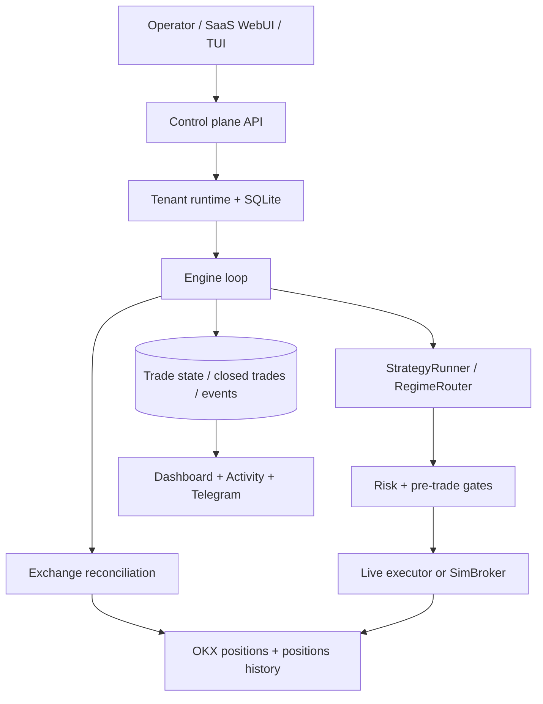

# Architecture

xAuby เป็น single-process engine ที่แยก `SymbolContext` ต่อคู่เทรด และแยก
runtime/database ต่อ tenant เมื่อทำงานใน SaaS ทุกคำสั่ง live ต้องผ่าน risk gate
และทุกสถานะปิดต้อง reconcile กับ exchange

## Source-of-truth rules

1. OKX open positions เป็นความจริงเรื่อง position ที่ยังเปิดอยู่
2. OKX Positions History เป็นความจริงเรื่อง `realizedPnl`, fee, funding และ close time
3. local SQLite เป็น durable projection สำหรับ UI, audit และ replay ไม่ใช่ตัวแทนยอด PnL เมื่อ exchange ปิดไปแล้ว
4. ถ้าประวัติดึงไม่ได้หรือ match ไม่ชัดเจน ระบบ fail-closed: แสดง `FLAT/WAIT`, block entry และเก็บ pending reconciliation

## Isolation และ hardening

- แต่ละ tenant ใช้ Linux user, runtime root และ SQLite ของตนเอง
- systemd ใช้ `NoNewPrivileges`, `ProtectSystem=strict`, resource quota และ credentials บน tmpfs mode 0600
- UI อ่าน SQLite แบบ read-only; การเปลี่ยนแปลง state ทำผ่าน control-plane/API ที่ตรวจ CSRF, origin และ audit log
- adapter และ engine แยกจาก UI เพื่อให้การ reconcile ทำงานได้แม้ dashboard ไม่พร้อม

## Lifecycle

`engine loop -> reconcile -> strategy tick -> execution -> persist -> snapshot`

การ reconcile เกิดก่อน strategy ทุก cycle เสมอ จึงไม่มี entry ใหม่ใน cycle ที่ยัง
ต้องรอการยืนยัน close จาก OKX

