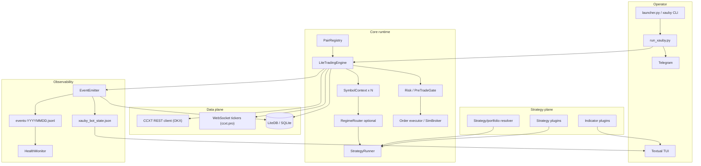
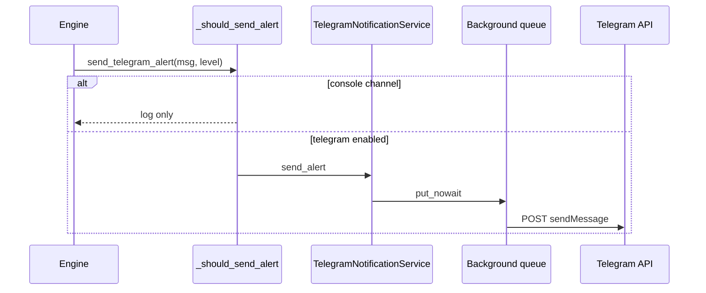

# Architecture

xAuby is a **single-process, multi-symbol perpetual-swap** trading system,
currently committed to **OKX** (`api.okx.com`) routed through the
exchange-neutral **CCXT** adapter. Configuration drives behavior; the engine
does not hard-code pair lists, strategy choices, or chart overlays. The native
Binance.th spot gateway (`xauby/api/exchanges/exchange_binance.py`) still
exists in the exchange plugin registry but is not the active baseline.

A separate multi-tenant **SaaS control plane** (`xauby/saas/`, FastAPI) hosts
isolated copies of this same engine for other operators, each in its own OS
user / systemd unit / config root — see the root
[README.md#saas-control-plane](../README.md#saas-control-plane). It sits
outside this diagram; every box below describes one tenant's (or the
single-owner) engine process.

## Layered view

## Dependency rules

| Rule | Rationale |
|------|-----------|
| `observability` does not import `engine` | Replay and health stay engine-agnostic |
| TUI is read-only (`LiteDB(readonly=True)`) | UI cannot block or mutate trades |
| Secrets only in `.env` | `bot_config.yaml` is safe to commit because it has no keys |
| One engine instance | `core/.engine.lock` prevents double live trading |
| Strategy and indicator plugins travel together | Chart/legend must match actual strategy behavior |
| Engine stays strategy-agnostic | Strategy signal and exit logic belong to strategy config/plugins |

## Pair registry

`PairRegistry` merges:

1. `coin_whitelist.json` assets (strategy, mode, primary/confirm timeframe per coin)
2. `data.pairs` in YAML when legacy or explicit list is needed
3. Optional `DEFAULT_SYMBOL` from environment

With `architecture.whitelist_strict: true`, the whitelist is the source of truth. With `hot_reload_enabled: true`, file mtime is polled every `reload_interval_seconds`. On change, the engine re-inits symbol contexts and refreshes WebSocket subscriptions.

## Symbol context

Each active pair gets a `SymbolContext`:

- Tick snapshot using WebSocket plus REST fallback
- Current strategy and optional handoff target
- Current regime and last regime snapshot
- Per-symbol execution mode (`sim` or `live`)
- Semi-auto pending state
- Last signal metadata for TUI and Telegram

Pairs are isolated at strategy/runner/context level. Portfolio capital and global guards are shared intentionally.

## Strategy routing

RegimeRouter is opt-in per pair:

1. Global `architecture.regime_router_enabled` must be true.
2. Asset `regime_router_enabled` must be true.
3. A live asset also needs `regime_router_live_confirmed: true`.

If a live asset enables router without live confirmation, the engine forces that asset to sim.

Current committed pattern:

| Symbol | Mode | Strategy baseline | Sides | Router state |
|--------|------|-------------------|-------|--------------|
| `XAU` (XAUUSDT) | Live | `xauby_actionzone` (CDC Action Zone V3) | Long + short | Off |
| `BTC` (BTCUSDT) | Live | `supertrend_ema200` | Long + short | Off |

## Notification pipeline

`TelegramCommandPoller` runs a separate thread for `/status`, `/pnl`, `/regime`, and related commands.

## Database

SQLite (`core/xauby.db`) stores:

- Candles per symbol / timeframe
- Trade state (`idle` / `bought`)
- Closed trades
- Event index alongside JSONL

Retention policies in `bot_config.yaml` prune old candles and events on a schedule.
