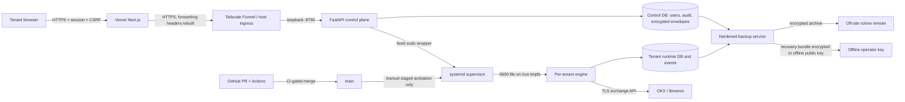

# SaaS threat model

Last reviewed: 2026-08-01

This document is the security model for the hosted xAuby control plane and its
tenant engines. It turns the trust boundaries found during the 2026-07-28 code
audit into an explicit register. It is a code-and-deployment-design review, not
a penetration test or proof of the live host's configuration.

## Scope and security objectives

In scope: the Vercel Pilot Workspace, the FastAPI control plane, authentication
and manual-trade endpoints, encrypted exchange and Telegram credentials,
per-tenant systemd engines, runtime SQLite/event state, exchange APIs, backups,
and the GitHub path that can put code on `main`.

The primary objectives are:

1. A tenant cannot read or control another tenant's account or engine.
2. A browser request cannot place or replay a trade without the authenticated
   user's explicit authorization.
3. Exchange credentials are never returned to a browser or persisted in
   plaintext storage.
4. A deployment or restart cannot create a second engine against the same
   exchange account or silently lose track of live exposure.
5. A compromised dependency, CI job, backup, or low-privilege service does not
   silently become authority over customer capital.

Public research content and the standalone local/TUI installation are outside
scope except where they share the same engine or repository supply chain.

## Data flow and trust boundaries

The important boundaries are:

- **Browser to Vercel:** all input is hostile. State-changing requests require
  a session, Origin validation, and a per-session CSRF token.
- **Vercel to control plane:** `api-proxy.ts` requires HTTPS in production,
  drops browser-authored forwarding headers, and rebuilds the client IP from a
  trusted edge header before the control plane applies rate limits.
- **Control plane to engine:** the control service is not root. It can invoke
  only fixed provisioning/service wrappers. Engines have separate Unix users,
  config roots, runtime roots, and systemd units.
- **Encrypted store to runtime:** credential envelopes use AES-256-GCM with AAD
  bound to tenant and target. Plaintext is materialized only as a mode-0600
  environment file below `/run` tmpfs and is removed on stop or disconnect.
- **Engine to exchange:** an exchange API key controls capital. The account lock,
  pre-trade gates, reconciliation, and controlled-restart preflight are capital
  boundaries, not only availability controls.
- **GitHub to production:** CI validates `main`, but VPS activation remains a
  manual, staged operation. GitHub Actions must never restart the trading host.
- **Host to recovery store:** the off-site archive is encrypted independently;
  the matching recovery private key must never be installed on the VPS.

## Threat register

| ID | Threat | Controls in the repository | Residual risk / required validation |
|---|---|---|---|
| TM-01 | Session theft or credential guessing | httpOnly/SameSite cookies, Secure production setting, Argon2, TOTP, revocation, bounded login/PIN/email throttles | Confirm production cookie flags and TLS from the live endpoint |
| TM-02 | Client spoofs its IP to evade throttles | Vercel proxy removes `Forwarded`, `X-Forwarded-*`, and `X-Real-IP`, then rebuilds one trusted value | Re-test whenever ingress or trusted edge headers change |
| TM-03 | CSRF or replay places a manual trade | Origin + CSRF checks, TOTP, Trade PIN, short-lived challenge digest, idempotency key, audit log | Browser/API penetration testing remains outstanding |
| TM-04 | Cross-tenant data access or engine control | Tenant-scoped store queries, shared `require_admin`, platform-admin + TOTP, separate tenant config/runtime directories | OS isolation is partial: engine users share the `xauby-engines` group and host kernel |
| TM-05 | Credential disclosure from DB, logs, browser, or stale runtime file | AES-GCM envelopes with tenant/target AAD; responses omit blobs; tmpfs mode 0600; disconnect and stop clear materialized files; secret history scan | Host root or simultaneous theft of master key and DB can decrypt current rows |
| TM-06 | A key with withdrawal permission is treated as safe | Venue-specific tri-state permission check; errors and unknown response shapes fail to `unknown`, never pass | Endpoint shapes still require one controlled test against each real venue |
| TM-07 | Duplicate engine or unsafe restart doubles exposure | Per-account lock, per-checkout lock, tracked-position preflight, DB/exchange reconciliation, staged release and rollback procedure | Operator must run pre/post checks; CI is intentionally not a deploy mechanism |
| TM-08 | Malicious dependency or CI action reaches `main` | Blocking tests/lint/secret scan, weekly dependency audit, Dependabot, CodeQL default setup, SPDX SBOM; SBOM action is commit-SHA pinned and jobs use read-only contents permission | `pandas-ta` git dependency is not covered by `pip-audit`; see accepted risks |
| TM-09 | VPS loss destroys credentials and recovery state | AES-GCM backup, GPG-encrypted recovery bundle, restore drill, versioned credential-key rotation | Control is not active until rclone remote, backup key, and offline GPG recipient are configured and a restore drill passes |
| TM-10 | Resource exhaustion takes down auth or a live engine | Argon2 concurrency bound, request/body limits, proxy timeout, systemd MemoryHigh/Max, CPUQuota, TasksMax | One host and one kernel remain a shared failure domain; no external load test in this review |
| TM-11 | Untrusted strategy/plugin executes arbitrary code | Static registry, maturity gate, certificate/config fingerprint, whitelist-strict live startup | No sandbox; third-party strategy loading must remain disabled until isolation exists |
| TM-12 | Events, errors, or artifacts leak secrets | structured redaction conventions, runtime state ignored by git, tracked/history secret scan, generic proxy errors | Operational log review and retention controls require live-host verification |
| TM-13 | Next image optimization reaches vulnerable sharp/libvips | only reviewed `next/image` usage is `unoptimized`; CI rejects new imports, missing `unoptimized`, and direct `/_next/image` calls | Advisory remains accepted until a forward Next/sharp fix is available |

## Accepted dependency risks

These are explicit, bounded exceptions rather than claims that the dependency
set is clean:

- **`pandas-ta` / `PYSEC-2026-3447`:** accepted temporarily because the selected
  fork caps setuptools at the affected version and `pip-audit` cannot inventory
  the git package. The audit still blocks every other finding. Revisit on every
  Dependabot/security workflow change and replace, patch, or lift the exception
  when the fork permits it.
- **Next/sharp/libvips high advisories:** accepted temporarily because the only
  offered remediation is a major downgrade and there is no forward-fixed Next
  16 release. `npm audit` continues to block critical findings, reports the
  highs, and the image-optimizer policy prevents expansion of the vulnerable
  execution path. Remove the exception when a forward fix ships.

Risk acceptance does not authorize enabling a new code path. Expanding either
dependency's use requires updating this model and the relevant CI policy in the
same PR.

## Review and validation

Review this model when authentication, ingress, tenant/process isolation,
credential storage, engine activation, exchange support, backup design, GitHub
workflows, or third-party strategy loading changes. A production security
release is not complete until the deployment baseline in
`security-saas-audit-2026-07-28.md` is checked against the live host.

Still outstanding outside this code review: penetration testing, live-host
configuration inspection, real-venue withdrawal-permission tests, off-site
backup activation, and a successful restore drill using the offline key.
