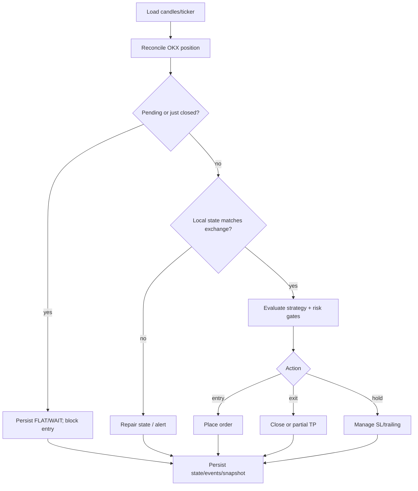

# Trading flow

แต่ละ symbol ทำงานตามลำดับนี้ในทุก engine cycle:



## OKX close reconciliation

เมื่อ local มี position แต่ `fetch_positions` ของ OKX ไม่พบ position แล้ว ระบบ
จะไม่คำนวณ PnL จาก ticker หรือราคาล่าสุด ระบบจะค้นหา Positions History แล้ว
จับคู่ด้วย symbol, side, quantity, เวลา และ position ID จากนั้นบันทึก closed
trade เพียงครั้งเดียวด้วยยอด `realizedPnl` ของ OKX ซึ่งรวม fee และ funding แล้ว

- close ที่ยืนยันแล้ว: state เป็น `idle`, quantity/entry เป็นศูนย์, action `WAIT`
- partial TP: หักยอดที่บันทึกไปแล้วก่อนบันทึก final close เพื่อป้องกันนับซ้ำ
- history unavailable/ambiguous: `pending`, `FLAT/WAIT`, block entry และ retry
- หลัง close ที่ยืนยันแล้ว ระบบบังคับ WAIT อย่างน้อยหนึ่ง cycle ก่อนประเมิน entry

ใช้ recovery tool เมื่อต้องตรวจรายการที่เกิดก่อน deploy:

```bash
python scripts/reconcile_exchange_close.py --db /path/to/tenant.sqlite --dry-run
python scripts/reconcile_exchange_close.py --db /path/to/tenant.sqlite \
  --exchange-close-id 'okx:<position-id>:<close-ms>' --apply
```

`--apply` ต้องระบุ close ID แบบ exact match เสมอ; dry-run ไม่แก้ database

## Position lifecycle

1. Entry ผ่าน strategy, risk, leverage และ stop-loss gates แล้วจึงส่ง order
2. Fill ถูกเก็บพร้อม exchange position ID
3. Strategy exit, stop-loss หรือ TP อาจปิดทั้งหมด/บางส่วนบน OKX
4. ทุก cycle ตรวจ open position และ history ก่อน strategy tick
5. Dashboard ใช้ snapshot ล่าสุด: มี position แสดงรายละเอียด, ไม่มี positionแสดง `FLAT` และ realized PnL ล่าสุด

## Short

บน OKX swap การเปิด short ใช้ SELL และการปิด short ใช้ reduce-only BUY
การตรวจสอบใช้ exchange positions ไม่ใช่ spot balance จึงตรวจพบ short ที่ปิดด้วย
TP ได้เหมือน long และไม่สร้าง position ค้างใน local state

