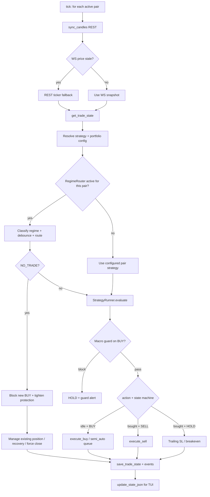

# Trading flow

This document describes one **tick** of `LiteTradingEngine` for a single symbol. The outer `tick()` loops all active pairs from `PairRegistry`.

## Tick sequence per symbol

## Entry path

1. Protection checks daily trade count, daily loss %, consecutive losses, and max open positions.
2. PreTradeGate checks min notional and slippage vs signal price.
3. Sizing resolves portfolio config for the symbol and applies global deploy caps.
4. Order path uses live executor or SimBroker depending on per-symbol mode.
5. Stop-loss is placed on exchange for live mode or monitored locally/simulated for sim mode.
6. Telegram reports filled or simulated trade with symbol tag and mode.

## Exit path

Triggers include:

- Strategy SELL signal
- Local SL confirmed over `sl_confirm_ticks`
- Exchange SL fill detection
- RegimeRouter NO_TRADE force close after configured candles
- `max_hold_hours` / minimal ROI tables when configured

Failed sells attempt SL restoration; a critical Telegram alert is sent if restore fails.

## Strategy handoff

When RegimeRouter changes strategy while a position is open:

- The open position keeps its original strategy owner.
- New entries are blocked or deferred until handoff completes.
- Handoff completes only after the position closes.
- The engine emits handoff events for observability.

This prevents a new strategy from managing exits for a position it did not open.

## NO_TRADE handling

For regimes mapped to `None`:

- New BUY entries are blocked.
- Existing stop protection remains active.
- Trailing stop tightens to 1x ATR when available.
- Recovery requires `regime_router.recovery_candles` tradeable candles.
- Force close can trigger after `regime_router.force_close_candles` NO_TRADE candles.

Current NO_TRADE regimes are `PANIC_SELL`, `BEAR_BREAKDOWN`, and `BEAR_TREND_STRONG`.

## Multi-pair concurrency

| Setting | Effect |
|---------|--------|
| `trading.max_open_positions` | Counts `bought` states across all symbols when configured |
| `risk_pct` | Per-entry deploy fraction; engine caps by deploy slots |
| Independent `SymbolContext` | BTC and XAUT do not share signal state |
| Per-symbol `mode` | BTC can sim soak while XAUT remains live |
| Portfolio config | Capital allocation remains shared by design |

## Modes

| `trading.mode` | BUY behavior |
|----------------|--------------|
| `full_auto` | Execute when signal + guards pass |
| `semi_auto` | Telegram inline confirm; timeout skips the trade |

See [telegram.md](telegram.md) for operator commands and alert types.

## Short execution

Short-capable strategies emit `OPEN SHORT` and `CLOSE SHORT` rather than
overloading BUY/SELL. On USDT perpetual, open maps to SELL and close maps to a
reduce-only BUY. Stop loss is above entry and fixed take profit is below entry.
Position reconciliation uses the exchange position endpoint (not spot balances)
and blocks trading on orphan or side-mismatched positions. Existing BUY/SELL
strategies continue to map to long open/close for backward compatibility.
