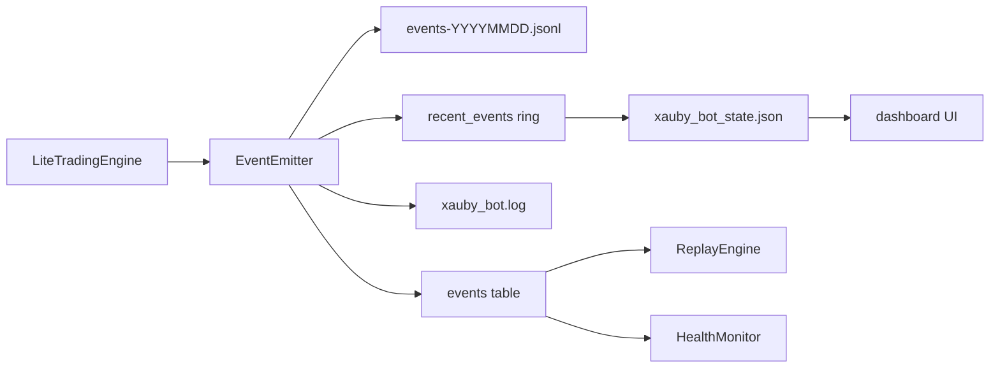

# xAuby Observability Layer

Engine-agnostic observability for xAuby trading bots. Dependency direction is one-way: `engine -> observability`. Observability never imports the engine.

## Components

| Module | Purpose |
|--------|---------|
| `events.py` | `Event`, `EventType` constants, `run_id` |
| `logging.py` | Structured logging with `run_id` / `tick_id` context |
| `store.py` | Dual event store: JSONL write-ahead plus SQLite index |
| `emitter.py` | `EventEmitter` facade: log, store, ring buffer |
| `health.py` | `HealthMonitor`: resources, API, process, events, logs |
| `replay.py` | `ContextBuilder`, `PositionSimulator`, `ReplayEngine` |
| `incidents.py` | Incident Explorer: list runs, timelines, notable filter |
| `event_coverage.py` | Wired event catalog plus run integrity audit |
| `replay_validation.py` | Replay validation: coverage plus live vs re-run strategy diff |
| `state.py` | `StateExporter`: `xauby_bot_state.json` schema for TUI |
| `protocols.py` | `EngineProtocol` seam for future engines |

## Event flow



## Event types

Lifecycle: `signal_rejected`, `risk_check_passed`, `position_opened`, `position_closed`, `stop_loss_updated`, `stop_loss_triggered`

Engine: `engine_started`, `engine_stopped`, `tick`, `heartbeat`, `error`

Signal: `signal_evaluated`, `guard_blocked`

Connectivity: `ws_disconnected`, `ws_reconnected`

Orders: `order_submitted`, `order_filled`, `partial_tp_executed`

Routing and safety: regime changes, NO_TRADE blocks, and strategy handoff events are emitted when RegimeRouter is active.

## CLI tools

```bash
# Full health report as JSON
python health_check.py

# Incident Explorer: list runs / show timeline
python scripts/incident_explorer.py list
python scripts/incident_explorer.py show <run_id>

# Replay validation: re-run strategy at logged ticks, diff signal_evaluated
python scripts/replay_validate.py <run_id> --symbol XAUUSDT
python scripts/replay_validate.py <run_id> --symbol BTCUSDT --json

# Legacy incident trace
python scripts/replay_incident.py <run_id>

# Strategy-plugin replay backtest
python scripts/replay_backtest.py --symbol XAUUSDT
python scripts/replay_backtest.py --symbol BTCUSDT
```

## TUI Incident Explorer

From the dashboard tmux session, press `4` or `i`:

- Browse recent engine runs (`run_id`, ICT time range, event count)
- Timeline for selected run with `seq`, `tick_id`, event type, payload
- `j` / `k` moves prev/next run
- `a` toggles notable vs all events
- `+` / `-` scrolls
- `v` runs replay validation

## Event coverage

`event_coverage.py` tracks wired event types the engine emits and audits run integrity:

- Monotonic `seq` ordering
- `signal_evaluated` paired with a `tick` (`tick_id`)
- `order_filled` preceded by `order_submitted` for the same side
- `position_opened` preceded by `risk_check_passed` or `order_filled`

Contextual types such as orders, positions, WebSocket events, and errors may be absent on idle runs. That is expected and reported as missing context rather than an automatic failure.

## Replay validation

For each `signal_evaluated` event in a run, validation:

1. Pairs the event with its `tick` for price and position state.
2. Rebuilds `MarketContext` from DB candles at that timestamp.
3. Resolves the active strategy config for that symbol.
4. Re-runs the strategy plugin.
5. Reports PASS if event integrity is OK and every replayed action matches the recorded action.

Limitations: validation checks strategy output before macro guard, cooldown, RegimeRouter execution overrides, and order placement. Candle snapshots must cover the event time with enough bars for the strategy.

The validated run must also contain durable `tick` events. The committed
baseline keeps `observability.durable_high_frequency_events: false` to limit
write volume, so enable it temporarily before a controlled replay-validation
run and restore it afterwards. A historical run without durable ticks cannot be
backfilled; every signal will be skipped with `no_tick_pair`.

Short-side parity is not certified by the current validator: persisted
`signal_evaluated` events contain the legacy BUY/SELL dispatch action but not
semantic `intent` + `position_side`, and replay validation does not restore the
position side into `MarketContext`. Add those fields and side-aware comparison
before using replay output as evidence for increasing live capital.

## Storage

- JSONL: `core/logs/events/events-YYYYMMDD.jsonl`
- SQLite: `events` table in `core/xauby.db`
- State: `core/logs/xauby_bot_state.json` includes `run_id`, per-pair mode, strategy, and recent events

## Future engines

Implement `EngineProtocol`:

```python
def get_state_snapshot(self) -> dict: ...
def get_recent_events(self, limit: int = 20) -> list: ...
```

Wire an `EventEmitter` in `__init__` and call `emit()` at lifecycle points. No other observability changes should be required.
